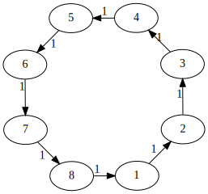
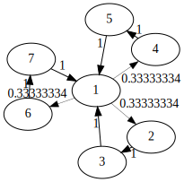
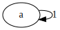

# Sequence Generators (in Alphabetical Order)

## `cyc` - Cycle Generator

Generates a fixed-duration cycle. The duration between the events will be determined by the number
of events, while the overall duration is fixed. 

Accepts [shorthand syntax](https://megra-doc.readthedocs.io/en/latest/function-reference/shorthand-syntax/).

#### Parameters

* name - generator name
* sequence - sequence description
* `:dur` - default space between events 
* `:rep` - probability of repeating an event (this might change the cycle duration)
* `:max-rep` - limits number of repetitions
* `:rnd` - random connection probability (currently not working the way I expected it ...)
* `:events` - use labeled events

### Syntax

```lisp
(cyc <name> :dur <duration> :rep <repetition probability> :max-rep <max number of repetitions> :rnd <random connection prob> <sequence>)
```

### Example 

The default duration for a cycle is 800ms. Thus, the following example will 
create an even beat with a time spacing of 200ms between each event:
```lisp
;; plain
(sx 'simple #t 
  (cyc 'beat (bd) (hats) (bd) (hats))) 
```

This one, on the other hand, will result in an event spacing of 266.666667ms (800/3),
while the overall cycle duration will remain:

```lisp
;; plain
(sx 'triplet #t
  (cyc 'perc (risset 2000) (risset 2000) (risset 2000)))
```

This can be used to create 3-against-4 rhythms very easily, which also makes the idea clearer:

```lisp
;; plain
(sx 'three-against-four #t
  (cyc 'beat (bd) (hats) (bd) (hats))
  (cyc 'perc (risset 2000) (risset 2000) (risset 2000)))
```

 

In this example, we make use of the reprtitions. Here you can see that Mégra isn't a cycle-language,
really, as this breaks the cycle length:

```lisp
;; with a 40% chance of repetition, 2 times at max
(sx 'simple #t
	(cyc 'beat :rep 40 :max-rep 2 (bd) (hats) (bd) (hats)))
```


```lisp
;; control cycles with a loop
(sx 'control #t
	(loop 'ba 
         :dur 1599 ;; switch just in time ... will run out of sync eventually
		 (ctrl (sx 'controlled #t (cyc 'fa (bd) (sn))))
		 (ctrl (sx 'controlled #t (cyc 'fa (hats) (hats))))		
		))
```

### Cycles from Vectors

You can use the `(vec ...)` structure to construct cycles:

```lisp
(let cycsource (vec (saw 100) (saw 200) (saw 120)))

(sx 'ba #t
	(cyc 'foo loopsource))
```

You can use this feature to create more abstract generator functions:

```lisp
(fun x3 (a)
	(vec a a a))
	
(sx 'ba #t
	(cyc 'foo (x3 (saw 200))))
```

---

## `chop` - Chop Sample

Chop a sample into parts, that will be played as a loop. All other parameters of 
a loop can be applied (`rep`, `max-rep` and `rnd`).

### Examples

```lisp
;; chop violin sample into 8 parts (each of which is 200ms long)
(sx 'some #t
  (chop 'chops 8 (violin 'a3 :sus 200))) 
```

---

## `facts` - Factors for Parameters 

This is great to use together with the `cmp` (compose) function to write shorthands

### Examples 

```lisp
;; make a melody
(sx 'foo #t
(cmp
	;; the second argument ('freq) is the parameter the factors are applied to
	(facts 'baz 'freq 1 1.2 0.9 1.3) ;; apply a series of factors to create a melody
	(nuc 'bar (saw 100))))

;; make complex rhythmms
(sx 'foo #t
(cmp
	;; 'dur is the duration parameter (between event onsets)
	(facts 'baz 'dur 1.25 0.75 1.5 0.5) ;; apply a series of factors to create a rhythm
	(loop 'bar (bd) (sn))))

```

---

## `flower` - Flower Generator

Create ... well, look at the examples.

##### Syntax
`(flower <name> :pistil <event> :layers <layers> :petals <events>)`

### Parameters

* `name` - generator name
* `:layers` - number of layers
* `:pistil` - pistil or central event
* `:petals` - list of events (will be padded to appropriate lenght if necessary)

### Examples

```lisp
;; flower with one layer and four petals
(sx 'a-rose-is-a #t
  (flower 'rose 
    :pistil (saw 100)
    :petals (saw 200) (saw 300) (saw 400) (saw 150)))
```


Flower with 2 layers:
```lisp
(sx 'a-rose-is-a #t
  (flower 'rose 
    :layers 2
    :pistil (saw 100)
    :petals (saw 200) (saw 300) (saw 400) (saw 150) 
            (saw 400) (saw 600) (saw 800) (saw 300)))
```


---


## `friendship` - Windmill Generator

This creates a directed version of a Friendship- or Windmill graph.

### Syntax

`(friendship <name> :center <center event> :friends <list of events>)`

### Parameters

* `name` - the generator name
* `:center` - the center of the "social circle"
* `:friends` - the "friends".
* `:rep` - chance of repetition.
* `:max-rep` - maximum number of repetitions
* `:rnd` - generate random shortcuts
* `:events` - collect labeled events

### Example

```lisp
(sx 'friend #t
  (cmp
    (pear (atk 1) (rel 90) (sus 10) (rev 0.07))
      (friendship 'ship 
        :dur 100
		:center  (saw 'a2) 
        :friends (saw 'c3) (saw 'e3) (saw 'b3) (saw 'd3) (saw 'f3) (saw 'c4))))
```



---

## `fully` - Random Generator

Each node follows each other node with equal probablity ... so basically a random generator.

### Syntax
```lisp
(fully <name> :dur <duration> <list of events>)
```

### Example

```lisp
;; random generator with five events
(sx 'full #t
    (fully 'mel (saw 'a3) (saw 'f2) (saw 'c3) (saw 'e3) (saw 'a4)))

```


---

## `infer` - Infer from Rules

Infer a generator from arbitrary rules. Make sure every event has
at least one exit, otherwise the generator will stop.

Also, exit probablities for each node should add up to 100.

### Parameters

* `name` - generator name
* `:events` - labeled event mapping
* `:rules` - transition rules - Format `(rule <source> <destination> <probability> <duration (optional)>)`

### Example

```lisp
;; infer 
(sx 'con #t 
  (infer 'duct :events 
    'a (saw 'a2)
    'b (saw 'f2)
    'c (saw 'c3)
    'd (saw 'e4)
    :rules 
    (rule 'a 'a 80 200) ;; repeat 'a with 80% chance
    (rule 'a 'b 20 200) ;; move to 'b with 20% chance
    (rule 'aaa 'c 100 200) ;; after 3 repetitions of 'a, always move to 'c
    (rule 'b 'b 100 400) ;; repeat 'b always
    (rule 'bb 'd 100 400) ;; ... well, 2x max
    (rule 'c 'c 100 100) ;; same for 'c
    (rule 'ccc 'a 100 400) 
    (rule 'd 'd 80 200) ;; 'd is repeated with 80% chance as well
    (rule 'd 'a 20 200) ;; and moves back to 'a with 20% chance
    (rule 'ddddd 'b 100 400))) ;; and is repeated 5x max

```


---

## `learn` - Learn a Generator

Learn a generator from a sample string. Based on the variable-order Markov chain learning algorithm
proposed in *Ron, Singer, Tishby - The Power of Amnesia (1996)*.

### Parameters
* `:events` - Event definitions. Can be a `map`.
* `:sample` - Sample string to learn from. Uses the defined event mapping as characters. Can be a `vec`.
* `:bound` - The maximum order of the learned markov chain, that is, how far to look back when determining the next step.
* `:epsilon` - Probability threshold, a connection that's less likely than that won't be learned. The higher, the longer it takes to learn.
* `:size` - Maximum generator size (nodes in the probabilistic finite automaton generated).
* `:autosilence` - Use `~` as default character for silence.
* `:tie` - Automatically restart in case this generator gets stuck in an "end state" (a state without children)

### Example

Learn a trap-like beat from a sample string. When event labels have only one character, the sample string 
doesn't need spaces.

```lisp
(sx 'from #t
  (learn 'data
    :events 'x (bd) 'o (sn) 'h (hats)
    :sample "xoxoxoxox~~o~h~~~h~h~h~~h~h~~hhh~x~o
             ~x~o~x~o~x~o~xh~h~~hhh~x~o~x~o~x~o~x
             ox~xox~xox~xoxo~xoxo~xoxox~oooo~xxxx
             ~xoxoxox~ohxhohxhohxhxhxhxhxhxhxhoho
             hoh"))
```


You can also use arbitrary labels for events, in which case you need to leave a space between tokens:

```lisp
(sx 'bat #f
  (learn 'alo 
    :events 'cat (saw 100) 'dog (saw 400) 'owl (saw 600)
    :sample 
    "cat cat dog owl ~ ~ ~ owl ~ ~ cat cat dog owl ~ ~ ~ owl ~ ~ cat dog owl cat"))
```

Lastly, you can use `map` and `vec` to assemble your learning data from external sources, such as OSC or MIDI.
Here's an example for a statical assembly (see documentation on map/vec and OSC to learn how to assemble things from 
external sources).

```lisp
(let ork (vec "~" "~" "~" "cat" "bat" "bat" "~" "~" "~" "cat" "bat" "cat"))
(let dork (map (pair "cat" (saw 300)) (pair "bat" (saw 600))))

(sx 'ba #f
  (learn 'tro :events dork :sample ork))
```

---

## `lin` - Linear Sequence

If you just need a simple, linear sequence (no repetition), this is the way to go. This is 
great to write scores, using the linear sequence with control events to score other generators.

### Example

```lisp
;; default durations
(sx 'conductor #t
  (lin 'score 
    (ctrl (sx 'part #t (cyc 'ga "bd ~ sn ~"))) 4000
	(ctrl (sx 'part #t (cyc 'ga "bd hats sn hats"))) 4000
	(ctrl (sx 'part #t (cyc 'ga "[bd cym] cym [sn cym] cym"))) 4000
	(ctrl (clear))
	))

```

---

## `loop` - Loop Generator

The `loop` generator, unlike `cyc`, creates a loop of events, where the overall duration is dependent
on the number of events you pass in.

Accepts [shorthand syntax](https://megra-doc.readthedocs.io/en/latest/function-reference/shorthand-syntax/).

### Example

```lisp
;; default durations
;; assuming the default duration is 200ms, this loop will have an overall duration (or cycle-time) of 800ms
(sx 'around #t
  (loop 'and-around (saw 100) (saw 200) (saw 300) (saw 400)))
  
;; assuming the default duration is 200ms, this loop will have an overall duration (or cycle-time) of 1000ms
(sx 'around #t
  (loop 'and-around (saw 100) (saw 200) (saw 300) (saw 400) (saw 500)))
  
;; compare with a cycle, on the other hand:
(sx 'around #t
  (cyc 'and-around (saw 100) (saw 200) (saw 300) (saw 400) (saw 500)))
  
;; custom durations
(sx 'around #t
  (loop 'and-around (saw 100) 400 (saw 200) 100 (saw 300) 200 (saw 400)))
```

---

## `nuc` - Nucleus Generator

Generates a one-node repeating generator, i.e. as a starting point for growing.

### Parameters

* name (symbol)
* event(s) (event or list of events) - events to be repeated
* `:dur` - transition duration between events

### Syntax

```lisp
(nuc <name> :dur <duration> <event(s)>)
```

### Example

```lisp
;; with one event
(sx 'just #t
  (nuc 'a-bassdrum :dur 400 (bd)))
  
;; with multiple events
(sx 'just #t
  (nuc 'a-bassdrum-and-a-snare :dur 400 (bd) (sn)))
```


---

## `stages` - Stages Generator
This generator arranges sound events in "stages". See for yourself.

### Syntax

`(stages <name> :pprev <prob> :pnext <prob> :dur <duration> <events>)`

### Parameters

* `name` - generator name
* `:dur` - duration between events
* `:pprev` - probability to return to previous stage
* `:pnext` - probability to advance to next stage
* `:cyc` - cyclical (last stage will advance to first stage)

### Example
```lisp
;; non-cyclical
(sx 'ba #t
  (stages 'ga :pprev 10 :pnext 10 (saw 100) (saw 200) (saw 300) (saw 400)))
```


```lisp
;; cyclical
(sx 'ba #t
  (stages 'ga :pprev 10 :pnext 10 (saw 100) (saw 200) (saw 300) (saw 400)))
```


## `vals` - Explicit Values for Parameters 

This is great to use together with the `cmp` (compose) function to write shorthands

### Examples 

```lisp
;; make a melody
(sx 'foo #t
(cmp
	;; the second argument ('freq) is the parameter the factors are applied to
	(vals 'baz 'freq 100 120 90 130) ;; apply a series of values to create a melody
	(nuc 'bar (saw))))

;; make complex rhythmms
(sx 'foo #t
(cmp
	;; 'dur is the duration parameter (between event onsets)
	(vals 'baz 'dur 250 150 300 100) ;; apply a series of values to create a rhythm
	(loop 'bar (bd) (sn))))

```
---
